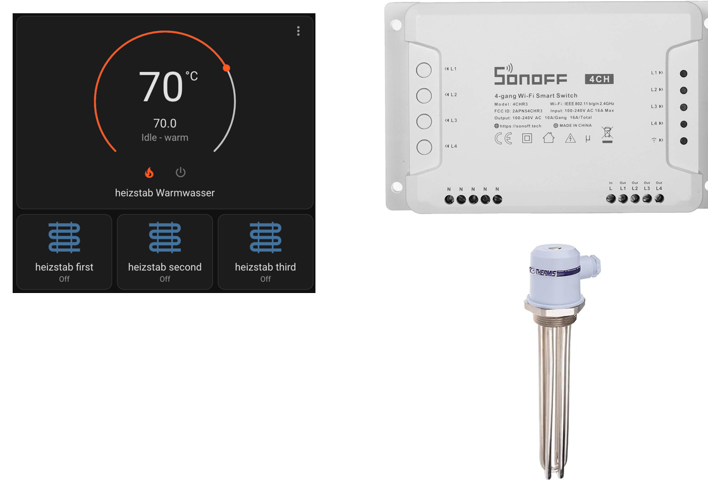

# Sonoff 4CH based diy power-to-heat device with esphome & home assistant

## What is it?

This is a diy project for building a smart water heater powered by the sun using cheap iot material and open source software. 

## Prerequisites

* a working [Home Assistant](https://github.com/home-assistant/) installation with [esphome](https://esphome.io/guides/getting_started_hassio) plugin installed
* a [Sonoff 4CH](https://sonoff.tech/product/diy-smart-switches/4chr3-4chpror3/) device (~30 EUR)
* a [THERMIS Heating Element 3000 W](https://www.amazon.de/THERMIS-Heizpatrone-Wasserspeicher-Warmwasserspeicher-Wasserheizung/dp/B0B49ZXN53) or similiar (~60 EUR)
* a smart meter connected to Home Assistant, e.g via [edl21](https://www.home-assistant.io/integrations/edl21/) 
* a temperature sensor connected to Home Assistant, e.g. DS18B20

## How does it work?

The Thermis water heating element with 3000 Watts consists of three independent heating elements with 1000 watts each. This should be sufficient for a normal 3-4 person household. With the Sonoff 4CH they can be switched independently with three different relays. Connected to a smart power meter the esphome flashed Sonoff 4CH is able to switch the relays independently depending on available PV power. The temperature of the power-to-heat device can be set in a thermostat device directly in home-assistant. The esphome powered Sonoff 4CH device will then automatically adjust the water temperature. 

The power-to-heat device is set up to constantly receive the *total_system_power* sensor value of the edl21 integration via home-assistant. This sensor value is transmitted every 1-2s. Therefore the power-to-heat device can switch the heating elements on/off if the heating power exceeds the available PV is power. The power-to-heat device turns the heating elements successively off or back on if other devices draw energy or not. 
  
## Further thoughts

### Is it worth to use a power control unit to use less than 1000 watts?

In case you worry about hours when the PV is providing less than 1000 watts: if would generally be possible to further control one heating element with a power control device. In my opinion, I tried it out, it is not worth the effort. Ignore it and size the PV accordingly to have more hours with more than 1000 watts.

### Wouldn't it be better to use a heat pump?

Definitely, but this is a lot easier to build, cheaper and serves you with warm water more than six months a year.

## License

The MIT License (MIT).
